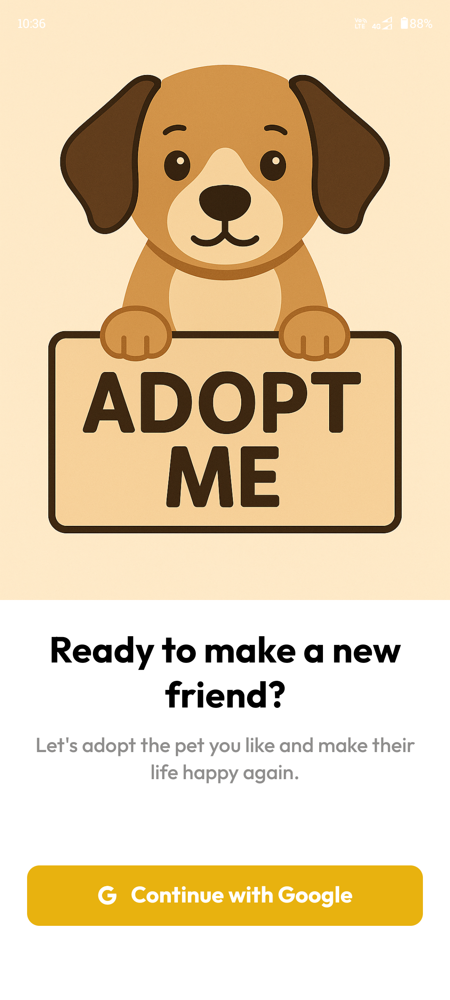
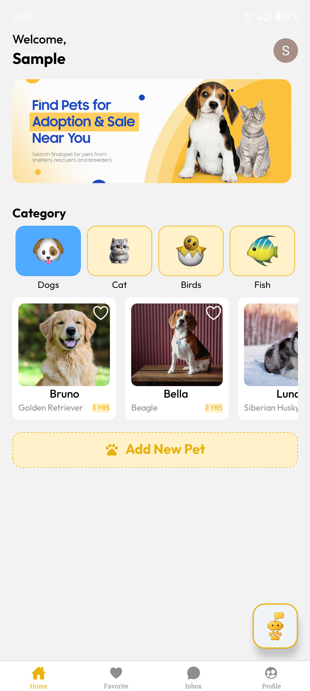
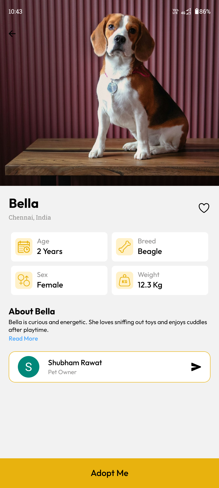
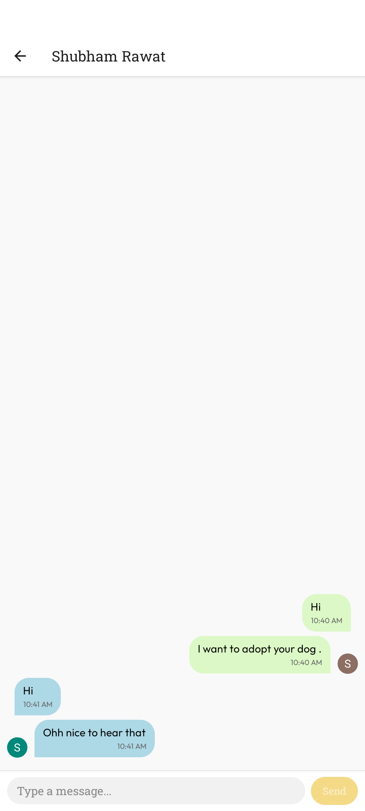
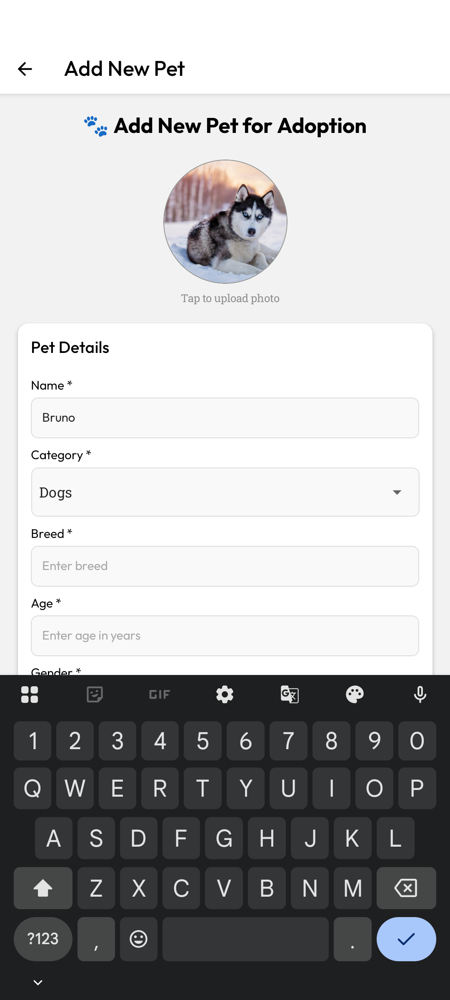
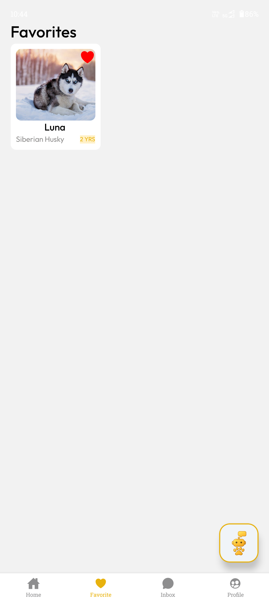
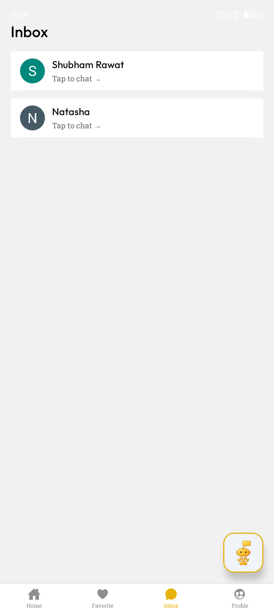
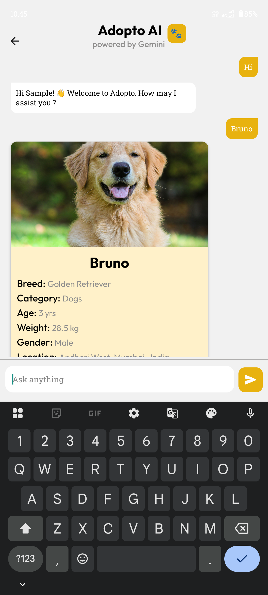
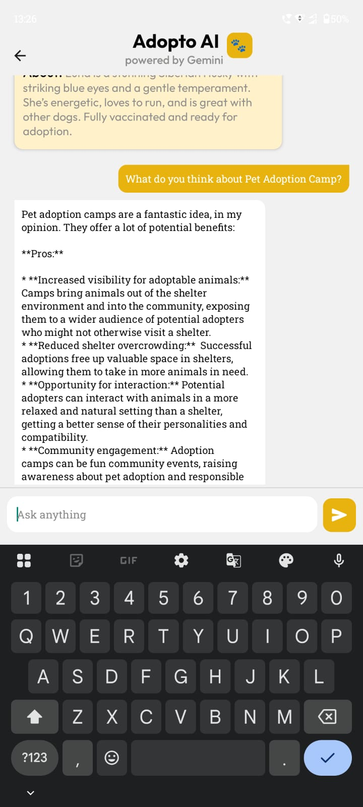
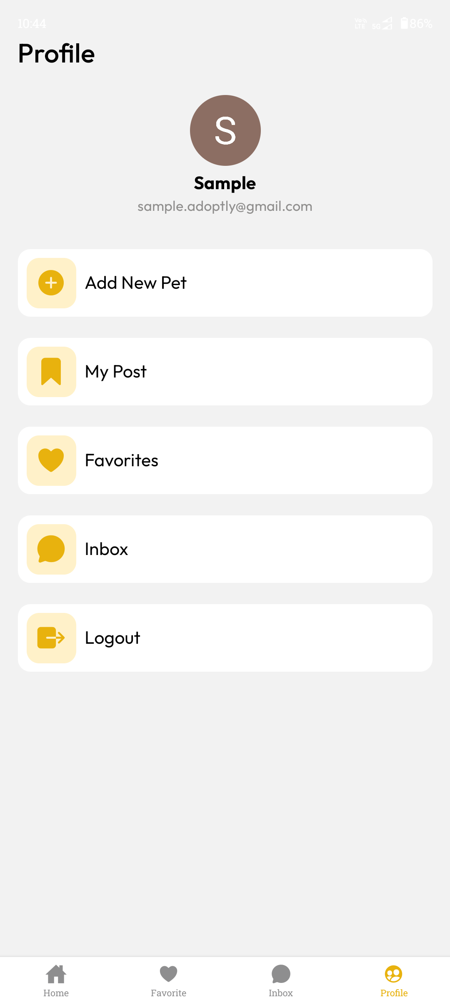

# 🐾 Adoptly – Pet Donation App &nbsp; &nbsp;

> **A modern React Native app** to find, donate, and adopt pets.
> Built with **Clerk** for secure authentication, **Firebase Firestore** for real-time data, and **Gemini API** for an AI-powered chatbot.

---

## 📌 Table of Contents

* [About](#about)
* [Features](#features)
* [Tech Stack](#tech-stack)
* [Installation](#installation)
* [Usage](#usage)
* [App Screenshots](#app-screenshots)
* [Download & QR Code](#download--qr-code)
* [Project Structure](#project-structure)
* [Contributing](#contributing)
* [License](#license)

---

## About

**Adoptly** is a platform to connect **pet owners and adopters**. Users can browse pets, favorite listings, chat with owners in real time, and even get **AI-driven assistance** for pet-related queries through **Adopto**, the in-app chatbot.

---

## ✨ Features

### **1. Google Authentication (Clerk)**

* Secure Google login & signup.
* Session management via Clerk.

### **2. Add New Pets for Adoption/Sale**

* Create listings with pet name, breed, age, health info, and photos.
* Quick donation/adoption process.

### **3. Manage Favorite Pets**

* Save favorite pets for easy access.
* Real-time updates via Firestore.

### **4. Real-Time Chat**

* In-app chat between adopters and pet owners.
* Messages synced instantly via Firestore.

### **5. Nearby Listings**

* Location-based pet discovery.
* Find pets/events near your city.

### **6. AI Chatbot – Adopto**

* Powered by **Gemini API**.
* Answers pet care queries, app navigation, and more.

### **7. Firestore Integration**

* Pet listings, favorites, and chats stored securely in real time.

### **8. Cross-Platform**

* Built with **React Native + Expo Router**.
* Works seamlessly on Android & iOS.

---

## 🛠 Tech Stack

* **React Native (Expo Router)**
* **Clerk** – Google OAuth
* **Firebase Firestore** – Real-time DB
* **Gemini API** – AI chatbot
* **React Native Paper** – UI Components
* **Zustand / Context API** – State management
* **FlashList** – Optimized chat rendering
* **React Navigation** – Routing

---

## 🚀 Installation

### Prerequisites

* Node.js `>=14`
* Expo CLI installed globally
* Firebase + Clerk accounts configured
* Gemini API Key

### Steps

```bash
# Clone the repo
git clone https://github.com/shubhmrwt01/Adoptly.git

# Go to project folder
cd Adoptly

# Install dependencies
npm install
# or
yarn install

# Start the development server
npm start
# or
yarn start
```

---

## ▶️ Usage

1. Run the dev server with `npm start` or `yarn start`.
2. Open **Expo Go** app and scan the QR code.
3. Sign in with Google to unlock features.
4. Browse, favorite, and chat about pets easily.

---

## 📱 App Screenshots

> Explore Adoptly’s clean and intuitive UI.

---

<p align="center">
  
  
  
</p>
<p align="center">
 
  
  
  
  
</p>
<p align="center">
  
  
  
</p>
---

## 📥 Download & QR Code

* **App URL**: [Adoptly](https://shorturl.at/2NBPt)

<p align="center">
  
</p>

---

## 📂 Project Structure

```
Adoptly/
├── app/
│   ├── (tabs)/
│   ├── chat/
│   ├── chatbot/
│   ├── pet-details/
│   ├── user-post/
│   ├── add-new-pet/
│   └── index.jsx
├── assets/
├── components/
├── config/
├── constants/
├── .env
├── package.json
└── README.md
```

---

## 🤝 Contributing

Contributions are welcome!

1. Fork the repo
2. Create a new branch: `git checkout -b feature-name`
3. Commit your changes: `git commit -m "Add feature"`
4. Push to branch: `git push origin feature-name`
5. Open a Pull Request

---

## 📜 License

This project is licensed under the [MIT License](LICENSE).

> © 2025 **Shubham Rawat** – All rights reserved.

---
