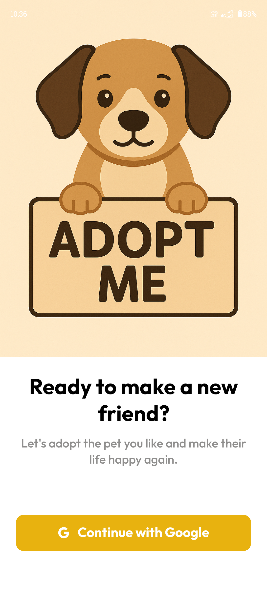
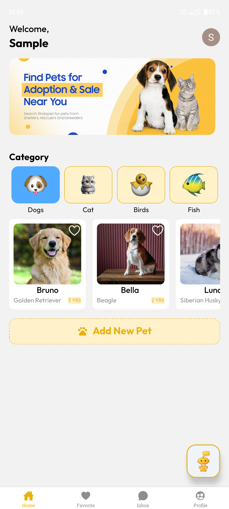
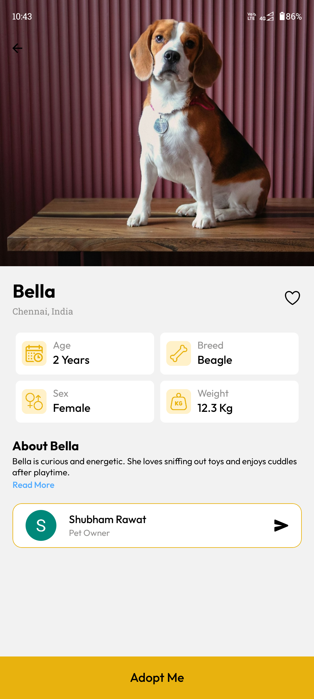
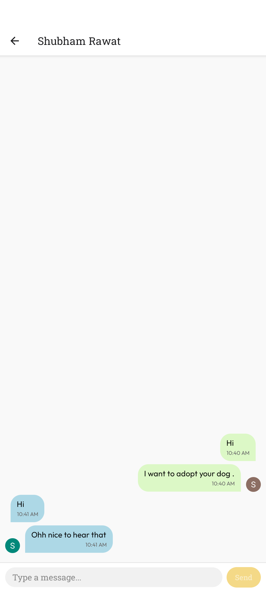
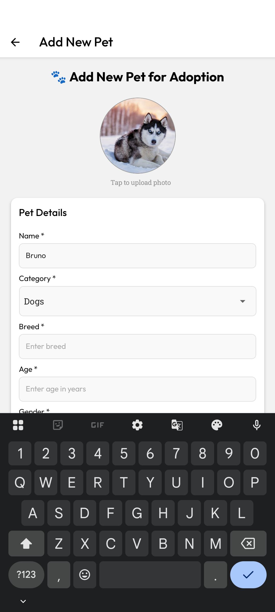
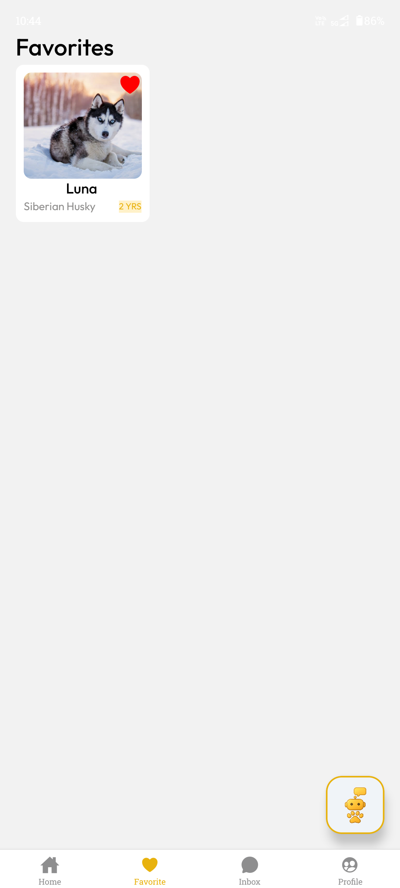
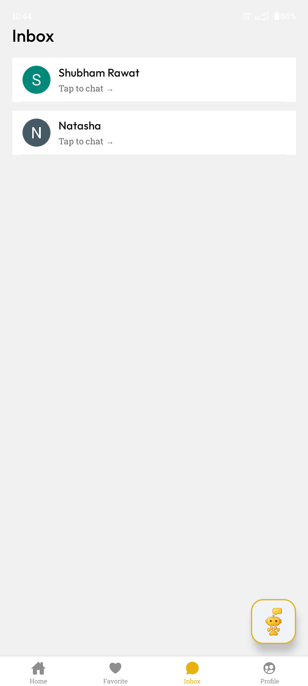
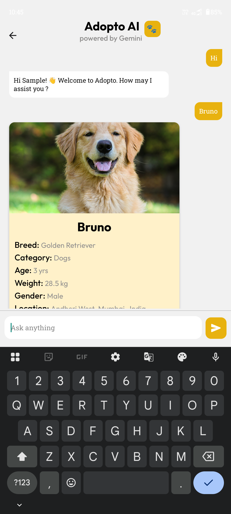
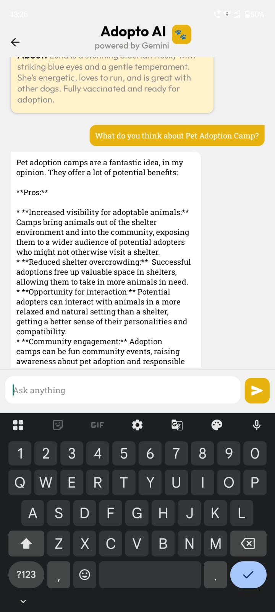
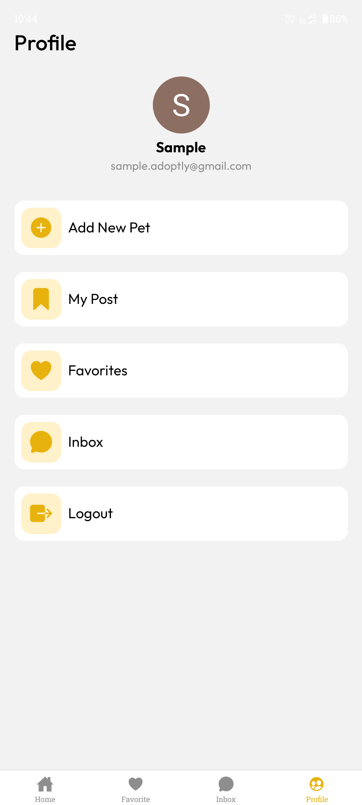

<div align="center">


# 🐾 Adoptly

### *Connect Hearts, Find Homes*

**A beautiful React Native app bringing pet owners and adopters together**

[](https://reactnative.dev/)
[](https://expo.dev/)
[](https://firebase.google.com/)
[](https://clerk.dev/)


---

[](https://drive.google.com/file/d/1NRpjEclp27CAJOwRgCdFfsJobySbidEr/view?usp=sharing)
&nbsp;
[](https://github.com/shubhmrwt01/Adoptly/issues)
&nbsp;
[](https://github.com/shubhmrwt01/Adoptly/issues)

</div>

---

## ✨ What Makes Adoptly Special

Adoptly isn't just another pet adoption app—it's a complete ecosystem designed to make pet adoption seamless, secure, and smart. With real-time communication, AI-powered assistance, and a beautiful interface, finding your perfect companion has never been easier.

<table>
<tr>
<td width="50%">

### 🔐 **Secure Authentication**
Google OAuth integration via Clerk ensures your data stays safe while keeping login friction-free.

### 💬 **Real-Time Chat**
Connect instantly with pet owners through our Firestore-powered messaging system.

### 🤖 **AI Assistant - Adopto**
Get instant answers about pet care, adoption tips, and app navigation powered by Gemini AI.

</td>
<td width="50%">

### ❤️ **Smart Favorites**
Bookmark pets you love and track them in real-time as their status updates.

### 📍 **Location-Based Discovery**
Find adorable pets and adoption events happening near you.

### 📱 **Cross-Platform**
Seamless experience on both Android and iOS with React Native.

</td>
</tr>
</table>

---

## 🎬 See It In Action

<div align="center">

### **Home & Discovery**
  

### **Pet Details & Management**
   

### **Chat & AI Assistant**
  

</div>

---

## 🚀 Quick Start

### Prerequisites

```bash
Node.js >= 14
Expo CLI
Firebase Account
Clerk Account
Gemini API Key
```

### Installation

```bash
# Clone the repository
git clone https://github.com/shubhmrwt01/Adoptly.git

# Navigate to project
cd Adoptly

# Install dependencies
npm install

# Start the development server
npm start
```

### Environment Setup

Create a `.env` file in the root directory:

```env
EXPO_PUBLIC_CLERK_PUBLISHABLE_KEY=your_clerk_key
EXPO_PUBLIC_FIREBASE_API_KEY=your_firebase_key
EXPO_PUBLIC_GEMINI_API_KEY=your_gemini_key
```

---

## 🏗️ Tech Stack

<div align="center">

| Category | Technology |
|----------|-----------|
| **Framework** | React Native with Expo Router |
| **Authentication** | Clerk (Google OAuth) |
| **Database** | Firebase Firestore |
| **AI Integration** | Google Gemini API |
| **UI Components** | React Native Paper |
| **State Management** | Zustand / Context API |
| **Navigation** | React Navigation |
| **Performance** | FlashList for optimized rendering |

</div>

---

## 📦 Features Breakdown

<details>
<summary><b>🔑 Authentication System</b></summary>

- Google Sign-In/Sign-Up via Clerk
- Persistent session management
- Secure token handling
- Profile management

</details>

<details>
<summary><b>🐕 Pet Management</b></summary>

- Create detailed pet listings
- Upload multiple photos
- Add comprehensive pet information (breed, age, health, etc.)
- Edit and delete your listings
- Track adoption status

</details>

<details>
<summary><b>💬 Communication</b></summary>

- Real-time messaging with pet owners
- Message history synced via Firestore
- Typing indicators
- Read receipts
- Image sharing in chat

</details>

<details>
<summary><b>🤖 AI Chatbot - Adopto</b></summary>

- Pet care advice
- Breed recommendations
- App navigation help
- Adoption process guidance
- Powered by Google Gemini

</details>

<details>
<summary><b>📍 Location Features</b></summary>

- Nearby pet listings
- Local adoption events
- Distance-based filtering
- Interactive map view

</details>


## 📂 Project Architecture

```
Adoptly/
├── 📱 app/
│   ├── (tabs)/              # Bottom tab navigation
│   ├── chat/                # Chat screens
│   ├── chatbot/             # AI assistant
│   ├── pet-details/         # Pet detail views
│   ├── user-post/           # User's pet listings
│   ├── add-new-pet/         # Pet creation flow
│   └── index.jsx            # Entry point
├── 🎨 assets/               # Images & icons
├── 🧩 components/           # Reusable components
├── ⚙️ config/               # Configuration files
├── 🔧 constants/            # App constants
├── 🔒 .env                  # Environment variables
└── 📦 package.json
```

---

## 🤝 Contributing

We love contributions! Here's how you can help:

1. **Fork** the repository
2. **Create** a feature branch (`git checkout -b feature/AmazingFeature`)
3. **Commit** your changes (`git commit -m 'Add some AmazingFeature'`)
4. **Push** to the branch (`git push origin feature/AmazingFeature`)
5. **Open** a Pull Request

### Development Guidelines

- Follow the existing code style
- Write meaningful commit messages
- Add tests for new features
- Update documentation as needed

---

## 🐛 Found a Bug?

If you find a bug or have a feature request, please [open an issue](https://github.com/shubhmrwt01/Adoptly/issues) with:
- Clear description
- Steps to reproduce
- Expected vs actual behavior
- Screenshots (if applicable)

---

## 📄 License

This project is licensed under the **MIT License** - see the [LICENSE](LICENSE) file for details.

---

## 👨‍💻 Author

<div align="center">

**Shubham Rawat**

[](https://github.com/shubhmrwt01)
[](https://linkedin.com/in/shubhmrwt01)

</div>

---

<div align="center">

### ⭐ Star this repo if you find it helpful!

**Made with ❤️ for pets and their future families**

*© 2025 Shubham Rawat. All rights reserved.*

</div>
